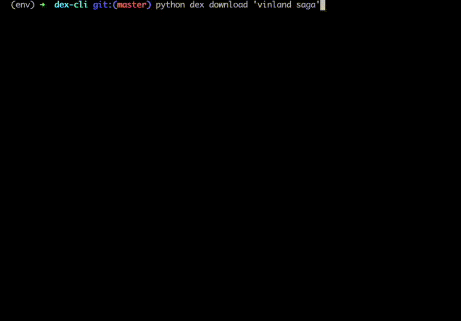

    # mangadex-cli
    

## Features 
- Designed to download manga from several manga providers
	- Current integrations:
		- mangadex.org
- Uses mutli-threading to download chapter images, for faster downloads
- Stitches downloaded images into a single PDF
- Well organised folder structure, along with meta-data i.e. last read timestamp

<b>Tested on Linux/macOS</b>
